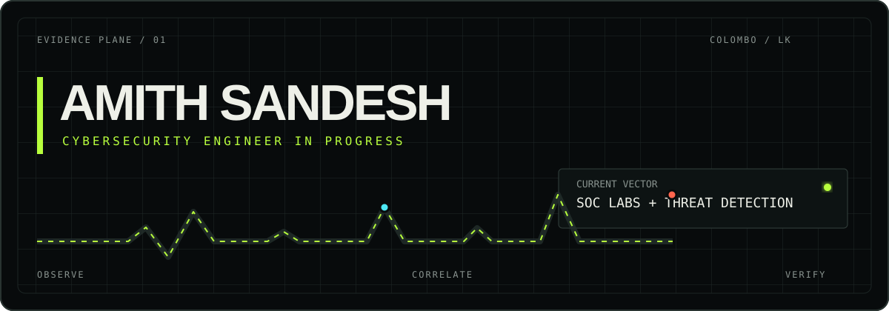
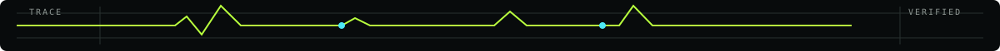

<p align="center">
  
</p>

<p align="center">
  <a href="https://amithhsandesh.github.io/portfolio/"></a>
  <a href="https://www.linkedin.com/in/amith-sandesh/"></a>
  <a href="mailto:Itsmeeamith@gmail.com"></a>
  
</p>

<p align="center"><samp>observe the signal / test the assumption / document the evidence</samp></p>

---

## `01 / operator profile`

I am Amith, based in Colombo, Sri Lanka. My public code started with web and desktop applications. My current direction is cybersecurity: SOC operations, detection engineering, controlled attack simulation, and incident-response practice.

```text
CURRENT VECTOR
SOC labs + threat detection

PUBLIC CODE
React / JavaScript / C# / .NET

LAB PRACTICE
Wazuh / ELK / Sysmon / Kali Linux

INFRASTRUCTURE
Linux / Docker / cloud / Tailscale

LEARNING PATH
CEH + Security+ + OSCP preparation

STATUS
building / testing / documenting
```

> Security work listed below reflects my current self-directed lab practice. CEH, Security+, and OSCP are study goals, not earned certifications.

<p align="center"></p>

## `02 / selected build evidence`

| Case file | What is public | Source |
|:--|:--|:--:|
| **Signal Room portfolio** | Dependency-free, responsive portfolio with a live GitHub profile pulse and GitHub Pages deployment | [Open site](https://amithhsandesh.github.io/portfolio/) · [Repository](https://github.com/AmithhSandesh/portfolio) |
| **CinemaHut** | React 19 + Vite movie-discovery interface with search, detail routes, favourites, and responsive UI | [Repository](https://github.com/AmithhSandesh/React_Movie_App) |
| **Blood Bank prototype** | .NET Framework 4.5 Windows Forms prototype with admin navigation, donor-form validation, and a SQL data-access helper | [Repository](https://github.com/AmithhSandesh/Blood-Bank-Management-System) |

<details>
<summary><strong>What I want to publish next</strong></summary>
<br>
A sanitized SOC-lab repository with an architecture diagram, controlled attack traces, Wazuh rules, alert evidence, incident notes, and reproducible setup steps. The goal is to turn the security claims on this profile into public technical evidence.
</details>

---

## `03 / lab notebook`

```diff
@@ RED / BLUE LAB — SELF-DIRECTED PRACTICE @@

+ Wazuh SIEM deployed in the lab environment
+ Kali, Windows, cloud, and workstation telemetry in the test setup
+ Sysmon telemetry feeding Windows security events
+ Controlled attack-to-detection exercises

! Cowrie honeypot deployment in progress
! ELK alongside Wazuh under active study
! Custom Wazuh rules and MITRE ATT&CK mapping in progress

# STUDY TRACK: CEH / CompTIA Security+ / OSCP preparation
```

The lab is where I practise the full loop: generate a known signal, observe the telemetry, investigate the alert, tune the rule, and write down what changed.

---

## `04 / capability map`

<table>
<tr>
<td width="50%" valign="top">
<strong>DETECT</strong><br><br>
<code>Wazuh</code><br>
<code>ELK Stack</code><br>
<code>Sysmon</code><br>
<code>Filebeat</code><br>
<code>Winlogbeat</code><br>
<code>Incident response</code>
</td>
<td width="50%" valign="top">
<strong>TEST</strong><br><br>
<code>Kali Linux</code><br>
<code>Nmap</code><br>
<code>Burp Suite</code><br>
<code>Metasploit</code><br>
<code>Wireshark</code><br>
<code>OSINT</code>
</td>
</tr>
<tr>
<td width="50%" valign="top">
<strong>BUILD</strong><br><br>
<code>React</code><br>
<code>JavaScript</code><br>
<code>TypeScript</code><br>
<code>Python</code><br>
<code>Node.js</code><br>
<code>C#</code>
</td>
<td width="50%" valign="top">
<strong>OPERATE</strong><br><br>
<code>Linux</code><br>
<code>Docker</code><br>
<code>Oracle Cloud</code><br>
<code>DigitalOcean</code><br>
<code>Tailscale</code><br>
<code>GitHub</code>
</td>
</tr>
</table>

<sub>The security and infrastructure tools above describe current profile-declared lab practice. The selected projects section links to the public code evidence available today.</sub>

---

## `05 / GitHub signal`

<p align="center">
  
  
</p>

<details>
<summary><strong>Why there is no giant language chart here</strong></summary>
<br>
Languages are context, not proof. A small repository can dominate a chart without representing depth. Open the case files instead and inspect the source.
</details>

---

## `06 / contribution trace`

<p align="center">
  <picture>
    <source media="(prefers-color-scheme: dark)" srcset="https://raw.githubusercontent.com/AmithhSandesh/AmithhSandesh/output/github-contribution-grid-snake-dark.svg">
    <source media="(prefers-color-scheme: light)" srcset="https://raw.githubusercontent.com/AmithhSandesh/AmithhSandesh/output/github-contribution-grid-snake.svg">
    
  </picture>
</p>

---

## `07 / open channel`

I am open to cybersecurity roles, SOC analyst opportunities, security internships, and collaborations where I can keep learning while producing useful technical work.

<p align="center">
  <a href="https://amithhsandesh.github.io/portfolio/"></a>
  <a href="https://www.linkedin.com/in/amith-sandesh/"></a>
  <a href="mailto:Itsmeeamith@gmail.com"></a>
  <a href="https://github.com/AmithhSandesh?tab=followers"></a>
</p>

<p align="center">
  <samp>AMITH SANDESH // COLOMBO, LK // BUILD THE LAB. READ THE LOG. FIX THE GAP.</samp>
</p>

<p align="center"></p>
